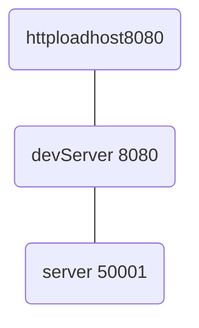

command line interface
# vue2
## 00结构、版本、配置文件
### 1、脚手架文件结构

[package.json 配置完全解读 - 掘金 (juejin.cn)](https://juejin.cn/post/7145759868010364959)
一个包全局安装后，另一个项目需要用时，还需要在安装一次

	├── node_modules 
	├── public
	│   ├── favicon.ico: 页签图标
	│   └── index.html: 主页面
	├── src
	│   ├── assets: 存放静态资源
	│   │   └── logo.png
	│   │── component: 存放组件
	│   │   └── HelloWorld.vue
	│   │── App.vue: 汇总所有组件
	│   │── main.js: 入口文件
	├── .gitignore: git版本管制忽略的配置
	├── babel.config.js: babel的配置文件[es6转es5]
	├── package.json: 应用包配置文件 
	├── README.md: 应用描述文件
	├── package-lock.json：包版本控制文件
	
#### 初始化脚手架
1. 全局安装@vue/cli（仅第一次执行）
	`npm install -g @vue/cli`

2. **切换到你要创建项目的目录**，然后使用命令创建项目
	`vue create xxxx`

3. 启动项目
	`npm run serve`
4. 备注
	- (如出现下载缓慢请配置 npm 淘宝镜像：npm config set registry https://registry.npm.taobao.org
	- Vue 脚手架隐藏了所有 webpack 相关的配置，若想看具体的 webpakc 配置，请执行： `vue inspect > output.js`


### 2、关于不同版本的Vue

1. vue.js与vue.runtime.xxx.js的区别：
    1. vue.js是完整版的Vue，包含：核心功能 + 模板解析器。
    2. vue.runtime.xxx.js是运行版的Vue，只包含：核心功能；没有模板解析器。
    <!-- vue.common.xxx.js有两种模块化，一种是common，一种是es6，如果使用common模块化默认引入这个 -->
    <!-- 模板解析器占用较大位置，当开发结束后[积累与疑惑](积累与疑惑.md)，转成html，css，js个格式以后，便不再需要模板解析器 -->
    <!-- .vue文件里的template在package.json里针对.vue文件的编译器==》模块可以写，vm中不能写，vm在.js文件中 -->
2. 因为vue.runtime.xxx.js没有模板解析器，所以不能使用template这个配置项，需要使用render函数接收到的createElement()函数去指定具体内容。
   render()函数接收到参数是createElement()函数，可以创建一个DOM元素
  ```js
        render: h => h(App),
    // render(createElement) {
    //     return createElement(App)
    // }
    //转化为箭头函数形式，createElement写成h
  ```
### 3、vue.config.js配置文件
 1. 使用vue inspect > output.js可以查看到Vue脚手架的默认配置。
 2. 使用vue.config.js配置文件,可以对脚手架进行个性化定制，详情见：https://cli.vuejs.org/zh
` 
<!-- public（favicon.ico，index.html）,src（main.js）不能更改, -->
## 01$ref属性

1. 被用来给元素或子组件注册引用信息（id的替代者）
<!-- 对于组件对象，ref获得组件对象。如果用的是id选择器，则获取组件对象对应的div盒子，class属性为组件的名字 -->
2. 应用在html标签上获取的是真实DOM元素，应用在组件标签上是组件实例对象（vc）
3. 使用方式：
    1. 打标识：```<h1 ref="xxx">.....</h1>``` 或 ```<School ref="xxx"></School>```
    2. 获取：```this.$refs.xxx```

## 02props配置项
<!-- 数据存在组建的实例对象vc中 -->
<!--todo 若props声明的变量未传参，默认undefined -->
<!--todo 传数据的时候不要用关键字或者保留字 -->
<!--todo 备注：props是只读的，Vue底层会监测你对props的修改，如果进行了修改，就会发出警告。-->
<!--todo 若业务需求确实需要修改，那么请复制props的内容到data中一份，然后去修改data中的数据（props内的数据优先级高于data，同时设置相同属性会报错）。 -->
<!-- //在data中设置一个新的属性去接props中要修改的数据eg: -->

1. 功能：让组件接收外部传过来的数据

2. 传递数据：```<Demo name="xxx"/>```
<!--todo 当xxx为表达式时```<Demo :name="xxx"/>``` -->

3. 接收数据：

    1. 第一种方式（只接收）：```props:['name'] ```
      <!-- 默认为string类型。 -->
      <!-- 若要改成Number -->
      <!--// {{age*1+1}}隐式类型转换 -->
      <!--//{{age+1}}配合 ：age="18" //age是个表达式执行的结果 -->
    2. 第二种方式（限制类型）：```props:{name:String}```
      <!--props：{name：数据类型}  -->
    3. 第三种方式（限制类型、限制必要性、指定默认值）：
     ```js
     props:{
        	name:{
        	type:String, //类型
        	required:true, //必要性
         <!--//若违反，可以运行，控制台报错 -->
        	default:'老王' //默认值
         <!--//不传递数据的时候，使用默认数据 -->
         <!-- required和default基本不同时写 -->
        	}
        }```

    4. props适用于：
         (1).父组件 ==> 子组件 通信
         (2).子组件 ==> 父组件 通信
         【父组件传给子组件一个函数，子组件利用此函数传递参数(触发事件)给父元素】
	[Vue中父组件向子组件传递数据的几种方法 - 掘金 (juejin.cn)](https://juejin.cn/post/6844903844946640910)

	5. 路由的props
	[[vue_router 路由#7.路由的props配置]]
	
## 03mixin(混入)   
1. 功能：
可以把多个组件共用的配置提取成一个混入对象
2. 使用方式：
第一步定义混合：
    -  新建一个.js文件，在里面以对象的形式定义mixin。
    - 采用分别暴露的形式暴露

```
    {
        data(){....},
        methods:{....}
        ....
    }
```
   - 例如：
```
	    {
	     methods: {
	         sayName() {
            console.log(this.name);
         }
          },
        };
         export const hunhe2 = {
	    mounted() {
        console.log("全局mounted");
	    },
		};
```

第二步使用混入：
- 以解构赋值的形式引入
	- eg:```import { hunhe2 } from './mixin';```
- 全局混入：在main.js中引入 ；```Vue.mixin(xxx)```
    <!-- todo 放在main.js文件中，（）内直接写名字 --> 
 - 局部混入：```mixins:[xxx]	```
    <!-- todo ** 数组，数组，数组 ** -->
    <!-- todo 一般发生冲突优先用自己的，再用混合的 -->
    <!-- todo 生命周期钩子发生冲突都要用，混合先于自己的 -->

## 04插件plugins

1. 功能：用于增强Vue

2. 本质：包含install方法的一个对象，install的第一个参数是Vue构造函数，第二个以后的参数是插件使用者传递的数据。

3. 定义插件：写一个.js文件，在里面用install注册并默认暴露

    ```js
    <!-- todo--> 
    export default {install(Vue,x,y,z){
		    全局注册
    }} 
    ```
	```js
    <!-- todo--> 
    对象.install = function (Vue, options) {
        // 1. 添加全局过滤器
        Vue.filter(....)
    
        // 2. 添加全局指令
        Vue.directive(....)
    
        // 3. 配置全局混入(合)
        Vue.mixin(....)
    
        // 4. 添加实例方法
        Vue.prototype.$myMethod = function () {...}
        Vue.prototype.$myProperty = xxxx
    }
    ```

4. 使用插件：先引入后注册
	%% 在main.js文件中引入注册后，全局可以直接用%%
	```Vue.use(插件名，参数)```

## 05scoped样式

1. 作用：让样式在局部生效，防止冲突。
2. 写法：```<style scoped>```
<!-- todo 原理:给最外层的div加了一层特殊的标签属性(随机生成)。再通过属性选择器实现 -->
<!-- todo  -->
<!-- //lang=less -->

## 06总结TodoList案例

1. 组件化编码流程：

    ​	(1).拆分静态组件：组件要按照功能点拆分，命名不要与html元素冲突。

    ​	(2).实现动态组件：考虑好数据的存放位置，数据是一个组件在用，还是一些组件在用：

    ​			1).一个组件在用：放在组件自身即可。

    ​			2). 一些组件在用：放在他们共同的父组件上（<span style="color:red">状态提升</span>）。

    ​	(3).实现交互：从绑定事件开始。

2. props适用于：

    ​	(1).父组件 ==> 子组件 通信

    ​	(2).子组件 ==> 父组件 通信（要求父先给子一个函数）
    【父组件传给子组件一个函数，子组件再利用此函数传递参数给父元素，父元素在此函数中接收数据，并添加到自己的数据中】

3. 使用v-model时要切记：v-model绑定的值不能是props传过来的值，因为props是不可以修改的！

4. props传过来的若是对象类型的值，修改对象中的属性时Vue不会报错，但不推荐这样做。
<!-- todo 法一：v-model -->
<!-- todo 法二：add -->
<!-- !id的写法：uuid；生成全球唯一字符串。有一个精简版叫nanoid -->
<!-- // 安装：npm i nanoid -->
<!-- // nanoid采用分别暴露的方式，引入方式如下： import {nanoid} from 'nanoid';-->
<!-- // 本质为函数，使用方式为 nanoid() -->
<!-- //id的其他写法：1.Math.random() 2.Date.now() -->

## 07webStorage
1. 存储内容大小一般支持5MB左右（不同浏览器可能还不一样）
2. 浏览器端通过 Window.sessionStorage 和 Window.localStorage 属性来实现本地存储机制。
   - Window.localStorage:浏览器关掉之后，仍旧存在；用户主动删除或者删除缓存，就没了
   - Window.sessionStorage：浏览器一关，就没了。
3. 相关API：

    1. ```xxxxxStorage.setItem('key', 'value');```
            该方法接受一个键和值作为参数，会把键值对添加到存储中，如果键名存在，则更新其对应的值。
            - 会把第二个参数用toString转化成String。eg：对象会变成[Object Object]
            - 为保留内容：`JSON.stringify(value)`
            - 键名要加‘’

    2. ```xxxxxStorage.getItem('person');```
        ​	该方法接受一个键名作为参数，返回键名对应的值。
	        - 读不出来返回null，JSON.parse(null)的值还是null
	        - 读取Object时，返回仍为string。建议使用：`JSON.parse(xxxxxStorage.getItem('person'))`


    3. ```xxxxxStorage.removeItem('key');```

        ​		该方法接受一个键名作为参数，并把该键名从存储中删除。

    4. ``` xxxxxStorage.clear()```

        ​		该方法会清空存储中的所有数据。

4. 备注：

    1. SessionStorage存储的内容会随着浏览器窗口关闭而消失。
    2. LocalStorage存储的内容，需要手动清除才会消失。
    3. ```xxxxxStorage.getItem(xxx)```如果xxx对应的value获取不到，那么getItem的返回值是null。
    4. ```JSON.parse(null)```的结果依然是null。

## 08组件的自定义事件

1. 一种组件间通信的方式，适用于：子组件 ===> 父组件

2. 使用场景：[子给父传数据，事件绑定在子上，在子身上触发事件。但是，事件的回调函数在父身上，父亲在此收到数据]A是父组件，B是子组件，B想给A传数据，那么就要在A中给B绑定自定义事件
（事件的回调在A中）。

3. 绑定自定义事件：

    1. 第一种方式，在父组件中：```<Demo @atguigu="test"/>```  或 ```<Demo v-on:atguigu="test"/>```

    2. 第二种方式，在父组件中：

        ```js
        <Demo ref="demo"/>
        ......
        mounted(){
           this.$refs.xxx.$on('atguigu',this.test)
	        //this.test是父组件内对应触发的函数
        ```

    3. 若想让自定义事件只能触发一次，可以使用```once```修饰符，或```$once```方法。

4. 触发自定义事件：在子组件内```this.$emit('atguigu',数据)```		

5. 解绑自定义事件：在子组件内
  1、```this.$off(['atguigu','demo'])```
  2、调用`this.$destroy()`函数（'自杀'或'他杀'）

6. 组件上绑定事件，默认为自定义事件。也可以绑定原生DOM事件，需要使用```native```事件修饰符。%%实际上是给子组件的根节点绑定了点击事件---利用了事件的委派%%
7. 注意：通过```this.$refs.xxx.$on('atguigu',回调)```绑定自定义事件时，回调要么配置在methods中<要么用箭头函数，否则this指向会出问题！
8. 给原生dom绑定自定义事件没有意义！ 因为无法书写$emit

## 09全局事件总线（GlobalEventBus）

要求：1. "所有组件都看得到"  2. 能调用到 `$on`,`$emit`
因此：1. 放在vue实例对象上（但不能调用 `$on`,`$emit`）  2. `Vue.prototype.$bus = vm/vc(实例对象)`   3. 因为vm也要用所以只能是 `Vue.prototype.$bus = vm(实例对象)`   4. 因为`new Vue({})`执行完后就晚了，再定义$bus就来不及了，所以只能在内部定义，而且要在`beforeCreate`里面

注：
%%

%%

1. 一种组件间通信的方式，适用于任意组件间通信。（原理：自定义事件）

2. 安装全局事件总线：
	- 全局事件总线放在`Vue.prototype===VueComponent.__proto__.prototype`	
   ```js
   new Vue({
   	......
   	beforeCreate() {
   	// 此时的vm里面什么数据都没加载，this指向的是一个空的vm
   		Vue.prototype.$bus = this 
   	//安装全局事件总线，$bus就是当前应用的vm
   	},
       ......
   }) 
   ```

3. 使用事件总线：

   1. 接收数据：A组件想接收数据，则在A组件中给$bus绑定自定义事件，事件的回调留在A组件自身。

      ```js
      methods(){
        demo(data){......}
      }
      ......
      mounted() {
        this.$bus.$on('xxxx',this.demo)
      }
      ```

   2. 提供数据：```this.$bus.$emit('xxxx',数据)```
	触发事件

4. **最好在beforeDestroy钩子中，用$off去解绑 当前组件所用到的事件。**
	 %%组件的自定义事件==不==需要再beforeDestroy钩子中销毁。因为组件的自定义事件绑定在自己身上，当组件销毁时，其身上绑定的自定义事件会被解绑。$bus中的自定义事件绑定 $bus上，即使使用了它的组件被销毁了，他也不会被解绑%%

子给父传数据，事件绑定在子上，在子身上触发事件。但是，事件的回调函数在父身上，父亲在此收到数据]
## 10消息订阅与发布（pubsub）
- 内在原理同全局事件总线一样，更推荐使用全局事件总线

1.  一种组件间通信的方式，适用于任意组件间通信。

2. 使用步骤：

   1. 安装pubsub：```npm i pubsub-js```
	   本质是一个对象

   2. 引入: ```import pubsub from 'pubsub-js'```

   3. 接收数据：A组件想接收数据，则在A组件中订阅消息，**订阅的回调留在A组件自身**。
	   - `pubsub.subscribe('msgNsme',function('msgNsme',value)) `
	   - 第二个参数是个函数，接受两个参数。分别为消息名字，接收到的数据。
	   - 因此，使用时要再回调函数中，将第一个参数设为msgName占位，若不用，可以设为__下划线
	
      ```js
      methods(){
        demo(data){......}
      }
      ......
      mounted() {
        this.pid = pubsub.subscribe('msgNsme',this.demo) //订阅消息
      }
      beforeDestroy() {
	      pubsub.unsubscribe(this.pid);
      }
      ```

   4. 提供数据：```pubsub.publish('msgNsme',数据)```

   5. 最好在beforeDestroy钩子中，用```pubsub.unsubscribe(pid)```**取消订阅**。
	

## 11 nextTick

1. 语法：```this.$nextTick(回调函数)```
2. 作用：在下一次 DOM 更新结束后执行其指定的回调。
3. 什么时候用：当改变数据后，要**基于更新后的新DOM**进行某些操作时，要在nextTick所指定的回调函数中执行。
%%有的程序员不写这个，用一个定时器代替，这个定时器不给时间，也可以解决，但不推荐（因为定时器本来也要推向队列执行）%%

## 12 Vue封装的过度与动画
- 在Vue当中，你可以给 （某一个节点）|（某一个组件）添加过渡动画效果
但是需要注意，节点|组件务必出现v-if|v-show指令才可以使用
1. 作用：在插入、更新或移除 DOM元素时，在合适的时候给元素添加样式类名。

2. 图示：

3. 写法：

   3.1. 准备好样式：

      - 元素进入的样式：
        1. v-enter：进入的起点
        2. v-enter-active：进入过程中(transaction写在这里)
        3. v-enter-to：进入的终点
      - 元素离开的样式：
        1. v-leave：离开的起点
        2. v-leave-active：离开过程中(transaction写在这里)
        3. v-leave-to：离开的终点

   3.2. 包裹要过度的元素:使用```<transition>```包裹要过度的元素。
	 `<transition>`解析完后丢掉，浏览器不显示
	   - 配置name属性：起了名字后，不再用默认的v，要用名字。例如：`v-enter-active`变为`hello-enter-active`。不写名字，默认为v
	   - 配置appear属性：` <transition appear>`或者` <transition ：appear="true">`。让动画一开始就放映。

      ```vue
      <transition name="hello">
      	<h1 v-show="isShow">你好啊！</h1>
      </transition>
      ```

   3.3. 包裹过多个要过度的元素:若有多个元素需要过度，则需要使用：```<transition-group>```，且每个元素都要指定```key``` #key 值。
   3.4.应用:
	   `v-enter-active,v-leave-active`配合`animation`;
	   `v-enter,v-leave-to; v-enter-to,v-leave`配合`transtion`;
	   %%进入的起点就是离开的终点,开始的终点就是离开的起点%%
	   %%`transtion`写在`v-xxx-active`或者标签里%%
```vue
    <transition-group name="todo" appear>
      <MyItem v-for="todo in todos" :key="todo.id" :todo="todo"></MyItem>
    </transition-group>
```
```css
.todo-enter-active {
  animation: todo 1s linear ;
}
.todo-leave-active {
animation: todo 1s linear reverse;
}
@keyframes todo {
  from {
    transform: translateX(100%);
  }
  to {
    transform: translateX(0px);
  }
}	
```
   
4.animate.css
	 - 安装`npm install animate.css`
	 - 引入`import 'animate.css'`//.css文件,直接写名字就行
	 - 在`<transition>`配置
		 - `appear`
		 - `name = 'animate__animated animate__bounce' `
		 - `enter-active-class =  你喜欢的动画 `
			 -eg: `enter-active-class = "animate__wobble" `
		 - `leave-active-class = 你喜欢的动画,后面有exit`


## 13 vue脚手架配置代理服务器
#### 复习
1. 发送AJAX请求
	1. xhr [03 Express](03%20Express.md)
	2. jQuery [04 JQuery与Ajax](04%20JQuery与Ajax.md)
	3. Axios(promise风格,支持请求拦截器、响应拦截器,体积小)
	4. fetch(与xhr平级,promise风格)/(jQuery,fetch封装xhr)/(缺点:包装了两层promise)
2. 同源：协议、域名、端口号要一致.否则跨域.[05跨域](05跨域.md)
3. 解决跨域:cors,jsonp,代理服务器
4. 注意:
	1. 服务器与服务器之间不收同源约束
	2. [3、vue config js配置文件](#3、vue%20config%20js配置文件)


### 方法一
​	在vue.config.js中添加如下配置：
```js
//开启代理服务器
devServer:{
//要把请求准发给谁,写到端口号即可
  proxy:"http://localhost:5000"
}
```
说明：
1. 优点：配置简单，请求资源时直接发给前端（8080）即可。
2. 缺点：a.不能配置多个代理，b.不能灵活的控制请求是否走代理,优先匹配前端路径。
3. 工作方式：若按照上述配置代理，当请求了前端不存在的资源时，那么该请求会转发给服务器 （优先匹配前端资源）
注意:
1. 改了脚手架的配置后,要重新开启脚手架
2. 代理服务器(https://cli.vuejs.org/zh/config/#devserver-proxy)
3. 记得在客户端把请求的端口号改为`devServer`的端口号,与客户端端口号一样
4. `devServer` 当请求的资源自己本身就有时,就用自己的(在public文件夹),不会转发请求

### 方法二
​	编写vue.config.js配置具体代理规则：
```js
module.exports = {
	devServer: {
      proxy: {
      '/api1': {// 匹配所有以 '/api1'开头的请求路径
        target: 'http://localhost:5000',// 代理目标的基础路径
        changeOrigin: true,
        //用于控制请求头中的host值,默认为true
        pathRewrite: {'^/api1': ''}
      },
      '/api2': {// 匹配所有以 '/api2'开头的请求路径
        target: 'http://localhost:5001',// 代理目标的基础路径
        changeOrigin: true,
        pathRewrite: {'^/api2': ''}
      }
    }
  }
}
/*
   changeOrigin设置为true时，服务器收到的请求头中的host为：localhost:5000
   changeOrigin设置为false时，服务器收到的请求头中的host为：localhost:8080
   changeOrigin默认值为true
*/
```

说明：

1. 优点：可以配置多个代理，且可以灵活的控制请求是否走代理。
2. 缺点：配置略微繁琐，请求资源时必须加前缀。

fetch,xhr可以直接用,不用引入,promise风格.但fetch会包两层promise
但用的较多的时axios
## 14 vue-resource
- 发送AJAX请求的库
## 15 插槽

1. 作用：让父组件可以向子组件指定位置插入html结构，也是一种组件间通信的方式，适用于 <strong style="color:red">父组件 ===> 子组件</strong> 。

2. 分类：默认插槽、具名插槽、作用域插槽

3. 使用方式：

### 1. 默认插槽：
1. 父组件直接在在子组件标签里写内容，子组件内用`<slot>`确定要插入的地方.默认会获取子组件标签内所有内容

      ```vue
      父组件中：
              <Category>
                 <div>html结构1</div>
              </Category>
      子组件中：
              <template>
                  <div>
                     <!-- 定义插槽 -->
                     <slot>插槽默认内容...</slot>
                  </div>
              </template>
        // <div>html结构1</div>是写在父组件中，并在父组件中解析。再插入子组件中。
      ```

### 2. 具名插槽：
1. 父组件:`<标签名 slot='xxx'>`  eg:`<a slot='xxx'>`
2. 子组件中`<slot name='xxx'>`  
3. ` v-slot:xxx`专门用于`<template>`
4. %%建议使用template标签%%

      ```vue
      父组件中：
              <Category>
                  <template slot="center">
                    <div>html结构1</div>
                  </template>
      
                  <template v-slot:footer>
                     <div>html结构2</div>
                  </template>
              </Category>
      子组件中：
              <template>
                  <div>
                     <!-- 定义插槽 -->
                     <slot name="center">插槽默认内容...</slot>
                     <slot name="footer">插槽默认内容...</slot>
                  </div>
              </template>
      ```

### 3. 作用域插槽：
1. 理解：<span style="color:red">数据在组件的自身，但根据数据生成的结构需要组件的使用者来决定。</span>（games数据在Category组件中，但使用数据所遍历出来的结构由App组件决定）%%插槽向插槽的使用者传递数据%%
2. 注意：
  - 在子组件的`<slot>` 中绑定数据
  - 在父组件中,**必需**用`<tamplate>`包裹起来,用`scope` 或者 `slot-scope` 接收数据.可以传递多个数据，接受的时候以对象形式接受。支持解构赋值
  - 作用域插槽也可以有名字

3. 具体编码：

```vue
 父组件中：
		<Category>
		// 子组件使用slot传递数据时,这里必须用template包
			<template scope="scopeData">
			// scope='xxx' ,也可以写成解构赋值
			// <template scope={games}>,在使用时直接使用games
				<!-- 生成的是ul列表 -->
				<ul>
					<li v-for="g in scopeData.games" :key="g">{{g}}</li>
				</ul>
			</template>
		</Category>
 
		<Category>
			<template slot-scope="scopeData">
				<!-- 生成的是h4标题 -->
				<h4 v-for="g in scopeData.games" :key="g">{{g}}</h4>
			</template>
		</Category>
 子组件中：
		 <template>
			 <div>
				 <slot :games="games"></slot>
				 // 数据传给了插槽的使用者:就是里面塞的结构
			 </div>
		 </template>
		
		 <script>
			 export default {
				 name:'Category',
				 props:['title'],
				 //数据在子组件自身
				 data() {
					 return {
						 games:['红色警戒','穿越火线','劲舞团','超级玛丽']
					 }
				 },
			 }
		 </script>
```


# other
## vc与vm

1.一个重要的内置关系：`VueComponent.prototype.__proto__ === Vue.prototype`

2.为什么要有这个关系：让组件实例对象（vc）可以访问到 Vue原型上的属性、方法。
	
关于VueComponent：
	1.school组件本质是一个名为VueComponent的构造函数，且不是程序员定义的，是Vue.extend生成的。
	2.我们只需要写<school/>或<school></school>，Vue解析时会帮我们创建school组件的实例对象，即Vue帮我们执行的：new VueComponent(options)。
	3.特别注意：每次调用Vue.extend，返回的都是一个全新的VueComponent！！！！
	4.关于this指向：
		(1).组件配置中：data函数、methods中的函数、watch中的函数、computed中的函数 它们的this均是【VueComponent实例对象】。
		(2).new Vue(options)配置中： data函数、methods中的函数、watch中的函数、computed中的函数 它们的this均是【Vue实例对象】。
	5.VueComponent的实例对象，以后简称vc（也可称之为：组件实例对象）。Vue的实例对象，以后简称vm。
	
Vue中使用组件的三大步骤：
一、定义组件(创建组件)
	使用Vue.extend(options)创建，其中options和new Vue(options)时传入的那个options几乎一样，但也有点区别；
	1.el不要写，为什么？ ——— 最终所有的组件都要经过一个vm的管理，由vm中的el决定服务哪个容器。
	2.data必须写成函数，为什么？ ———— 避免组件被复用时，数据存在引用关系。
	备注：使用template可以配置组件结构。
	
二、注册组件
	1.局部注册：靠new Vue的时候传入components选项
	2.全局注册：靠Vue.component('组件名',组件)

三、使用组件(写组件标签)
	编写组件标签：`<school></school>`